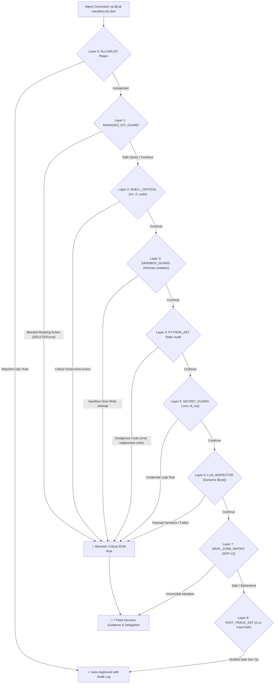

# Herdr Schengen (SmartGate) 🌍🛂🛃

> **Autonomous Multi-Agent Border Control & Trusted Clearance for Herdr Multiplexer**  
> *Balancing Cost-Effective Zero-Token Flow with Bulletproof Denylist Defense against YOLO Hazards.*

[](http://192.168.10.102:3000/InhouseOriented/herdr-schengen)
[](http://192.168.10.102:3000/InhouseOriented)
[](http://192.168.10.102:3000/InhouseOriented/herdr-schengen/actions)

---

## 🏛️ Core Purpose

**Herdr Schengen (SmartGate)** is a pre-execution security gatekeeper for coding agents
running inside the [Herdr](https://github.com/michaellperry/herdr) terminal multiplexer.
Every agent command is intercepted at the PTY boundary and routed through **9 deterministic
Decision Layers** (AST/SAST + LLM inspector) that auto-approve provably-safe operations and
delegate ambiguous or destructive ones to a human operator — replacing both per-command
interactive prompts and blanket `--dangerously-skip-permissions`.

Design background and history: [`docs/archive/motivation.md`](docs/archive/motivation.md).

## 🏛️ 9 Decision Layers Architecture



### 🛡️ Decision Layers Overview (Layer 0 ~ Layer 8)

| Layer ID | Layer Name | Inspection Scope & Policies |
| :--- | :--- | :--- |
| **Layer 0** | `ALLOWLIST` | Human-persisted allowlist regex rules verified by engineers |
| **Layer 1** | `MANAGED_GIT_GUARD` | Managed Git SCM (Forgejo, Gitea, GitHub, GitLab) API queries & issue/PR interactions |
| **Layer 2** | `SHELL_CRITICAL` | Destructive commands (`rm -rf`, `sudo`, `git push --force`, `git reset --hard`, `mkfs`) |
| **Layer 3** | `SANDBOX_GUARD` | Hermes Docker/microVM Sandbox write isolation (`> .hermes/sandboxes/...`, `cp/mv`, `touch`) |
| **Layer 4** | `PYTHON_AST` | Python AST static analysis (`eval()`, `exec()`, sensitive file opens, subprocess mutations) |
| **Layer 5** | `SECRET_GUARD` | Sensitive file access (`.env`, `id_rsa`, `hosts.yml`, `credentials.json`, exfiltration) |
| **Layer 6** | `LLM_INSPECTOR` | L2 Private Tool-Calling Multi-turn Semantic Inspector for dynamic substitutions `$(cat ...)` |
| **Layer 7** | `GRAY_ZONE_MATRIX` | Non-VCS Irreversible Mutation Matrix (ADR-004 / SOP-12) with structured decision guidance |
| **Layer 8** | `FAST_TRACK_AST` | Static verified development workflows (`git status`, `mkdir`, `pytest`, `npm run dev`) |

---

## 🛡️ Key Features

1. **Deterministic 1ms Python AST & Shell Denylist**:
   - Blocks privilege escalation (`sudo`, `su`, `chmod`), destructive file mutations (`rm -rf`, `mkfs`, `dd`), and unreviewed remote pushes (`git push`).
   - Protects sensitive files (`.env`, `id_rsa`, `credentials.json`, `hosts.yml`, `.aws/credentials`).
   - Protects Hermes sandbox paths (`~/.hermes/sandboxes/`) from unauthorized writes.
2. **Multi-Turn Tool-Calling Semantic Inspection**:
   - Inspects dynamic command substitution (`$(cat ...)`, `` `cat ...` ``, `$(<...)`).
   - Subagent reads referenced files via native Python I/O up to 8KB without spawning shell subprocesses.
3. **5 Anti-Loop & Anti-Hang Guardrails**:
   - **Strict Max Hops (2)**: Mathematical bound to prevent infinite tool-call turns.
   - **Native Direct I/O**: Eliminates prompt re-entrancy / self-trigger loops.
   - **Regular File Check (`stat.S_ISREG`)**: Rejects blocking FIFOs, sockets, and character devices.
   - **Symlink Canonicalization**: Traverses realpaths with visited sets to eliminate circular loops.
   - **Fail-Safe to Human**: Graceful bail-out to manual approval on network timeout or ambiguity.
4. **Self-Exclusion & Agent Isolation**:
   - The caller pane running the watcher is automatically excluded (`HERDR_PANE_ID`) to prevent self-recursive auto-approval.
   - Auto-targets all registered coding agents (`agy` and `opencode`) while ignoring non-target agents (Hermes, bare shells).
5. **Fail-Closed Bias**: Ambiguous commands or analyzer errors are deferred to the human operator, never auto-approved.

---

## 🚀 Getting Started

### Installation
```bash
# Global installation via npx skills
npx skills add ssh://git@salada-git:2222/InhouseOriented/herdr-schengen.git -g -y
```

### Launching the Gatekeeper

> The **TUI is the single owner of the daemon lifecycle** — start, stop, and reload the
> daemon only through it (`Ctrl+T` / `/toggle`).

```bash
# Any checkout: plain python3 with deps installed (textual, rich, httpx)
python3 scripts/cmd/schengen_tui.py

# Or with the dedicated portable virtualenv (see docs/guides/setup-from-scratch.md):
"$SCHENGEN_HOME/.venv/bin/python3" scripts/cmd/schengen_tui.py

# Check live daemon status (read-only diagnostics)
python3 scripts/cmd/schengen_watcher.py --status
```

---

## 🧰 Companion Tools

Standalone CLI utilities that ship with the repo (independent of the daemon lifecycle):

| Tool | Purpose |
| :--- | :--- |
| `scripts/cmd/schengen_history.py` | Audit history & diagnostics: `--recent 10`, `--search "git push"`, `--list-layers`, `--list-decisions`, `--pending` |
| `scripts/cmd/schengen_feature.py` | Feature-request / self-improvement backlog queue (`--add`, `--list`, ...) |
| `scripts/cmd/schengen_mcp.py` | Lightweight stdio MCP server bound to the live guard daemon |
| `scripts/cmd/smartgate.py`, `trusted_clearance.py`, `guard_watcher.py` | Backward-compatible aliases of `schengen_watcher.py` |

---

## 🧪 Testing & CI Pipeline

Comprehensive unit tests run with zero external dependencies in under a second:

```bash
# Run full unit test suite
python3 -m unittest discover -s tests -v

# Run live LLM integration tests (optional)
OPENAI_BASE_URL="https://api.openai.com/v1" \
GUARD_LLM_MODEL="gpt-5.6-luna" \
OPENAI_API_KEY="sk-..." \
python3 -m unittest tests/test_llm_evaluator_integration.py
```

### CI Triggers ([`.forgejo/workflows/llm_security_eval.yml`](.forgejo/workflows/llm_security_eval.yml))
- **Weekly Schedule**: Automated run every Monday at 00:00 UTC.
- **Pull Requests**: Runs on any PR targeting `main`.
- **Manual Dispatch**: 1-click execution from Forgejo Web UI.

---

## 📄 License & Development Model

- **License**: MIT — free to use, fork, and modify ([LICENSE](LICENSE)).
- **Development**: happens **only** on the private Forgejo instance
  ([InhouseOriented/herdr-schengen](http://192.168.10.102:3000/InhouseOriented/herdr-schengen)),
  with issue-first governance and weekly CI on Forgejo Actions.
- **GitHub**: [`README.github.md`](README.github.md) is a **one-way distribution mirror** —
  a synchronized snapshot; it does not accept issues, PRs, or support requests.
- **Contributions**: external contributions are **not** accepted. Fork the repository and
  maintain your own copy under the MIT License instead.

---

## 📚 Documentation

| Doc | Purpose |
| :--- | :--- |
| **[`docs/index.md`](docs/index.md)** | Master index: all ADRs, guides, TODOs, issues & archive with source-code mapping |
| **[`AGENTS.md`](AGENTS.md)** | Autonomous-engineering invariants (single-writer, fail-closed bias, mandatory tests, worktree isolation) |
| **[`docs/guides/setup.md`](docs/guides/setup.md)** | Full setup, dependencies & OpenCode integration |
| **[`docs/guides/configuration.md`](docs/guides/configuration.md)** | Environment variables, `config/schengen_watcher.json`, and runtime state layout |
| **[`docs/guides/setup-from-scratch.md`](docs/guides/setup-from-scratch.md)** | Clean-machine bootstrap (portable `$SCHENGEN_HOME/.venv`) |
| **[`docs/adr/`](docs/adr/)** | 13 Architecture Decision Records, each with `Status: Active` / `Evolved` |
