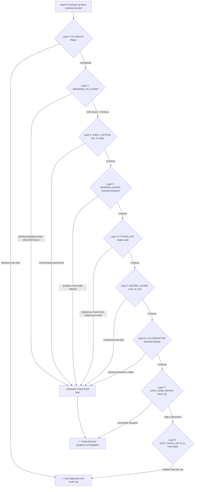

# Herdr Schengen (SmartGate) 🌍🛂🛃

> **Autonomous Multi-Agent Border Control & Trusted Clearance for Herdr Multiplexer**  
> *Balancing Cost-Effective Zero-Token Flow with Bulletproof Denylist Defense against YOLO Hazards.*

[](http://192.168.10.102:3000/InhouseOriented/herdr-schengen)
[](http://192.168.10.102:3000/InhouseOriented)
[](http://192.168.10.102:3000/InhouseOriented/herdr-schengen/actions)

---

## 📌 Project Maintenance & Long-Term Support Commitment

> **Notice to Developers, AI Agents & Contributors**:  
> This repository (`InhouseOriented/herdr-schengen`) is an **actively maintained, tier-1 core developer asset**. It is **NOT** a one-off experimental script.
>
> 1. **Continuous Rule & Heuristic Refinement**: Security patterns, AST evaluators, and denylist boundaries are continually updated to adapt to evolving multi-agent behaviors and shell patterns.
> 2. **Automated Weekly Quality Assurance**: Weekly scheduled CI runs ([`.forgejo/workflows/llm_security_eval.yml`](.forgejo/workflows/llm_security_eval.yml)) execute full unit and live integration tests against DeepSeek / GPT-OSS 120B to prevent regression.
> 3. **Active Issue-First Governance**: Bug reports, edge-case vulnerability disclosures, and feature proposals are actively triaged via the [Forgejo Issue Tracker](http://192.168.10.102:3000/InhouseOriented/herdr-schengen/issues).
> 4. **Long-Term Dotfiles Integration**: This repository serves as the definitive upstream source for all agent skill syncs (`npx skills`, Chezmoi dotfiles). It will remain maintained and backward-compatible.

---

## 🧭 The Motivation & Design Philosophy

### The Context: High-Velocity, Zero-Marginal-Cost AI Automation
As an active user of **Google Antigravity (AGY)** authenticated via **Google OAuth (Google One)**, our engineering environment leverages subscription-backed model access to achieve near-unlimited agent capabilities without incurring heavy per-token API bills from commercial pay-as-you-go providers (such as Anthropic Claude or OpenAI Codex).

### The Trade-Off: Autonomous Velocity vs. YOLO Disasters
When orchestrating multi-agent workflows across terminal multiplexers like [Herdr](https://github.com/michaellperry/herdr):
1. **The Friction Dilemma**: Standard interactive permission prompts require human intervention dozens of times per session, destroying autonomous agent velocity and cognitive flow.
2. **The "YOLO" Hazard**: Blindly granting unconditional auto-approval (`--dangerously-skip-permissions`) is a disaster waiting to happen. Autonomous coding agents can inadvertently run destructive commands (`rm -rf`, `git reset --hard`, `git push --force`), leak sensitive credentials (`.env`, `~/.ssh/id_rsa`, `.aws/credentials`), or mutate isolated sandboxes.

### The Solution: Herdr Schengen (SmartGate)
**Herdr Schengen** acts as an automated immigration border control for coding agents:

## 🏛️ 9 Decision Layers Architecture



### 🛡️ Decision Layers Overview (Layer 0 ~ Layer 8)

| Layer ID | Layer Name | Inspection Scope & Policies |
| :--- | :--- | :--- |
| **Layer 0** | `ALLOWLIST` | Human-persisted allowlist regex rules verified by engineers |
| **Layer 1** | `MANAGED_GIT_GUARD` | Managed Git SCM (Forgejo, Gitea, GitHub, GitLab) API queries & issue/PR interactions |
| **Layer 2** | `SHELL_CRITICAL` | Destructive commands (`rm -rf`, `sudo`, `git push --force`, `git reset --hard`, `mkfs`) |
| **Layer 3** | `SANDBOX_GUARD` | Hermes Docker/microVM Sandbox write isolation (`> .hermes/sandboxes/...`, `cp/mv`, `touch`) |
| **Layer 4** | `PYTHON_AST` | Python AST static analysis (`eval()`, `exec()`, sensitive file opens, subprocess mutations) |
| **Layer 5** | `SECRET_GUARD` | Sensitive file access (`.env`, `id_rsa`, `hosts.yml`, `credentials.json`, exfiltration) |
| **Layer 6** | `LLM_INSPECTOR` | L2 Private Tool-Calling Multi-turn Semantic Inspector for dynamic substitutions `$(cat ...)` |
| **Layer 7** | `GRAY_ZONE_MATRIX` | Non-VCS Irreversible Mutation Matrix (ADR-004 / SOP-12) with structured decision guidance |
| **Layer 8** | `FAST_TRACK_AST` | Static verified development workflows (`git status`, `mkdir`, `pytest`, `npm run dev`) |

---

## 🛡️ Key Features

1. **Deterministic 1ms Python AST & Shell Denylist**:
   - Blocks privilege escalation (`sudo`, `su`, `chmod`), destructive file mutations (`rm -rf`, `mkfs`, `dd`), and unreviewed remote pushes (`git push`).
   - Protects sensitive files (`.env`, `id_rsa`, `credentials.json`, `hosts.yml`, `.aws/credentials`).
   - Protects Hermes sandbox paths (`~/.hermes/sandboxes/`) from unauthorized writes.
2. **Multi-Turn Tool-Calling Semantic Inspection**:
   - Inspects dynamic command substitution (`$(cat ...)`, `` `cat ...` ``, `$(<...)`).
   - Subagent reads referenced files via native Python I/O up to 8KB without spawning shell subprocesses.
3. **5 Anti-Loop & Anti-Hang Guardrails**:
   - **Strict Max Hops (2)**: Mathematical bound to prevent infinite tool-call turns.
   - **Native Direct I/O**: Eliminates prompt re-entrancy / self-trigger loops.
   - **Regular File Check (`stat.S_ISREG`)**: Rejects blocking FIFOs, sockets, and character devices.
   - **Symlink Canonicalization**: Traverses realpaths with visited sets to eliminate circular loops.
   - **Fail-Safe to Human**: Graceful bail-out to manual approval on network timeout or ambiguity.
4. **Self-Exclusion & Agent Isolation**:
   - The caller pane running the watcher is automatically excluded (`HERDR_PANE_ID`) to prevent self-recursive auto-approval.
   - Strictly targets designated coding agents (`agent: "agy"` by default; `agent: "opencode"` opt-in via `--agent-filter agy,opencode`) while ignoring non-target agents (Hermes, bare shells).
5. **Auditing & History CLI (`schengen_history.py`)**:
   - Every approval and manual delegation is permanently logged to SQLite with timestamps, safety rationales, and exact decision layer attribution.

---

## 🚀 Getting Started

### Installation
```bash
# Global installation via npx skills
npx skills add ssh://git@salada-git:2222/InhouseOriented/herdr-schengen.git -g -y
```

### Quick Commands & History CLI
```bash
# 1. Start SmartGate daemon monitoring all active & future AGY panes
python3 scripts/schengen_watcher.py --target auto

# 1b. Also auto-approve OpenCode panes (explicit opt-in)
python3 scripts/schengen_watcher.py --target auto --agent-filter agy,opencode

# 2. Check live status and active Herdr panes
python3 scripts/schengen_watcher.py --status

# 3. View recent audit history with layer attribution
python3 scripts/schengen_history.py --recent 10

# 4. Search audit logs across commands and layers
python3 scripts/schengen_history.py --search "git push"

# 5. Discover decision layers and decision types
python3 scripts/schengen_history.py --list-layers
python3 scripts/schengen_history.py --list-decisions

# 6. Stop the SmartGate daemon
python3 scripts/schengen_watcher.py --stop
```

### Shell Aliases (`alias.zsh`)
- `smartgate`: Start background SmartGate daemon.
- `smartgate-status`: Show daemon PID, monitored panes, and recent SQLite audit events.
- `smartgate-history`: Query recent approval and rejection audit events.
- `smartgate-stop`: Terminate running SmartGate daemon.

---

## 🧪 Testing & CI Pipeline

Comprehensive unit tests run with zero external dependencies in 0.02s:

```bash
# Run full unit test suite (39 test cases)
python3 -m unittest discover -s tests -v

# Run live LLM integration tests (optional)
GUARD_LLM_ENDPOINT="https://api.deepseek.com/v1/chat/completions" \
GUARD_LLM_MODEL="deepseek-chat" \
DEEPSEEK_API_KEY="sk-..." \
python3 -m unittest tests/test_llm_evaluator_integration.py
```

### CI Triggers ([`.forgejo/workflows/llm_security_eval.yml`](.forgejo/workflows/llm_security_eval.yml))
- **Weekly Schedule**: Automated run every Monday at 00:00 UTC.
- **Pull Requests**: Runs on any PR targeting `main`.
- **Manual Dispatch**: 1-click execution from Forgejo Web UI.

---

## 🤝 Contributing & Extensibility

Herdr Schengen is designed to be open-source ready and modular:
- **New AST Rules**: Extend [`scripts/security_evaluator.py`](scripts/security_evaluator.py) to add language-specific parsers.
- **Custom LLM Providers**: Compatible with any OpenAI-compliant endpoint (vLLM, Ollama, DeepSeek, LocalAI).
- **Architecture Decision Records**: Consult [`docs/adr-001`](docs/adr-001-runtime-architecture-python-vs-go.md) and [`docs/adr-002`](docs/adr-002-dynamic-substitution-tool-calling-inspector.md) for technical trade-off details.

Pull requests, issues, and security rule proposals are warmly welcomed!
