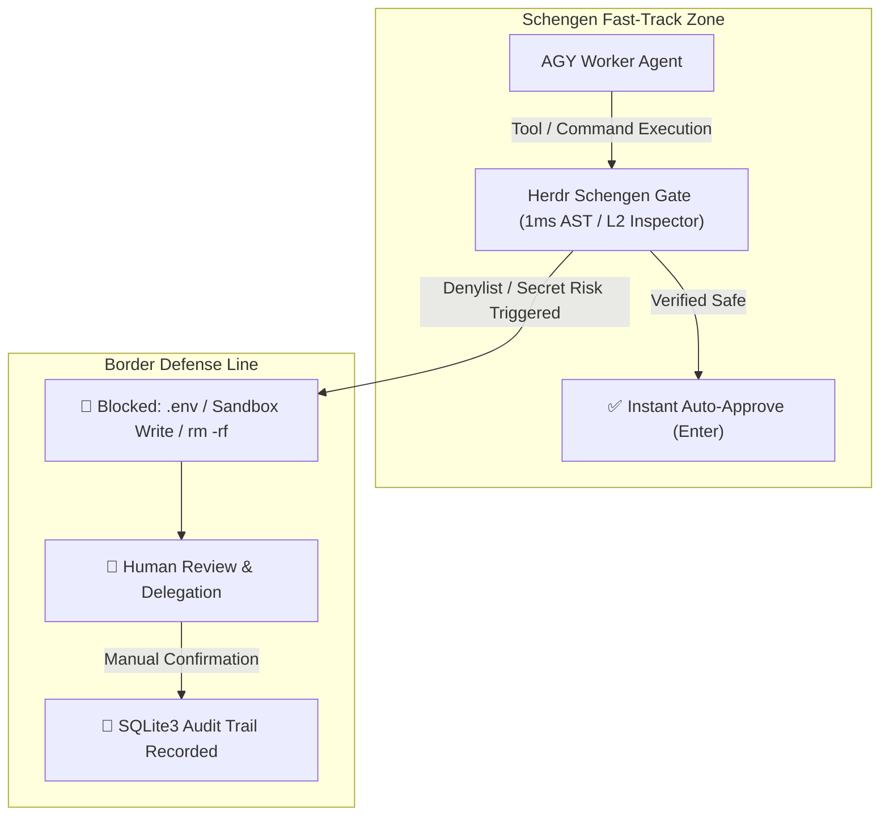

# Herdr Schengen (SmartGate / Trusted Clearance) 🌍🛂🛃

`herdr-schengen` (aliases: `trusted-clearance`, `smartgate`) is an automated **Trusted Clearance & SmartGate** security daemon for **Antigravity (AGY)** agents operating in the **Herdr terminal multiplexer** environment.

- **Schengen Fast-Track (Border-Free Flow / SmartGate)**: Verified safe development operations (AST validated) pass border control in **0.1 seconds** without manual confirmation prompts.
- **Strict Denylist & Border Control**: Secret credential access (`.env`, `id_rsa`), Hermes Sandbox write mutations, and destructive commands (`rm -rf`, `sudo`, `git push --force`) are immediately blocked and delegated to human review.
- **Self-Exclusion & Isolation**: The caller pane running the watcher (`HERDR_PANE_ID`) and non-target agent sessions (Hermes, bare shells) are strictly excluded from automated keystroke injection.

---

## 🚀 Quick Start & CLI Usage

### 1. Start SmartGate Daemon (Auto-detect active & future AGY panes)
```bash
# Main command
python3 ~/.agents/skills/herdr-schengen/scripts/schengen_watcher.py --target auto

# Alias command
python3 ~/.agents/skills/herdr-schengen/scripts/trusted_clearance.py --target auto
```

### 2. Enable Private Tool-Calling Semantic Inspector
```bash
python3 ~/.agents/skills/herdr-schengen/scripts/schengen_watcher.py --target auto --use-gpt-oss
```

### 3. Target a Specific Herdr Pane
```bash
python3 ~/.agents/skills/herdr-schengen/scripts/schengen_watcher.py --target wP:p2
```

### 4. Check SmartGate Status & Monitored Panes
```bash
python3 ~/.agents/skills/herdr-schengen/scripts/schengen_watcher.py --status
```

### 5. Stop SmartGate Daemon
```bash
python3 ~/.agents/skills/herdr-schengen/scripts/schengen_watcher.py --stop
```

### 6. Inspect Audit Statistics & Review Board
```bash
python3 ~/.agents/skills/herdr-schengen/scripts/schengen_watcher.py --stats
```

---

## 🧭 Core Governance Architecture



1. **Border-Free Flow (Schengen Principle)**:
   - Eliminates friction for routine development workflows while keeping the developer in control of critical decisions.
2. **Strict Singleton Integrity (`fcntl.flock`)**:
   - Uses `~/.local/state/herdr-schengen/schengen.lock` to guarantee a single active gatekeeper instance.
3. **Multi-Tiered Inspection (1ms AST ➔ L2 Tool-Calling LLM ➔ Human Review)**:
   - Static safe commands are cleared in 0.1s with zero LLM API cost.
   - Dynamic substitutions (`$(cat ...)`) are inspected in real-time by a private subagent before approval.

---

## 🛡️ Border Control Policy Summary

| Domain | Fast-Track Auto-Approved (`SAFE`) | Border Control Blocked (`DANGEROUS / MANUAL`) |
| :--- | :--- | :--- |
| **Target Agent** | **AGY (`agent: "agy"`) panes only** | Hermes, bare shells, and caller pane (`self`) 100% excluded |
| **Internal SCM (Forgejo)** | All `GET` requests, `/issues/...` interactions (POST, PATCH) | `DELETE` requests (`-X DELETE`, `method='DELETE'`) |
| **Environment / System** | `export PATH="..."` environment variable definitions | Direct mutations to `/etc`, `/System`, `/usr/bin` (`rm`, `chmod`) |
| **Shell Commands** | `git status/diff/add/commit`, `mkdir`, `cd`, `ls`, file edits | `rm -rf`, `sudo`, `su`, `chmod`, `chown`, `git push`, `git reset --hard` |
| **Hermes Sandbox** | Read-only inspection (`cat`, `ls`) | Write mutations (`> .hermes/sandboxes/...`, `cp/mv`, `touch`, `rsync`) |
| **Secrets & Keys** | Template handling (`.env.example`) | `cat .env`, `grep KEY .env`, `id_rsa`, `~/.aws`, `hosts.yml` access |
| **Python AST** | Data processing, linters, `pytest`, allowed Forgejo APIs | External unverified networking, `eval()`, `exec()`, sandbox writes |
