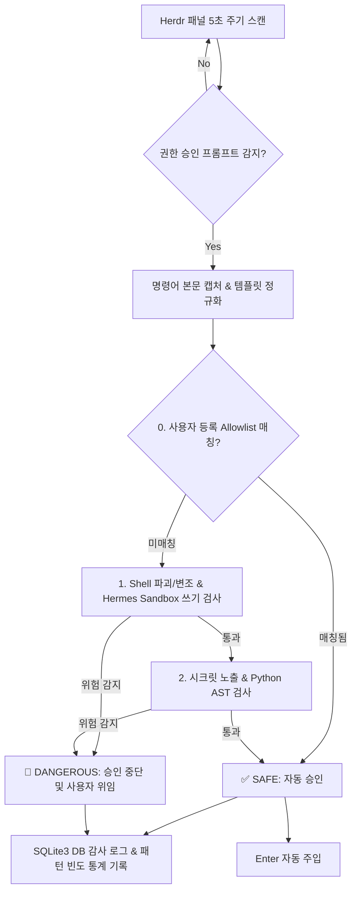

# Herdr Agent Guard 🛡️

`herdr-agent-guard`는 **Herdr 터미널 멀티플렉서** 환경에서 백그라운드로 실행 중인 코딩 에이전트(AGY, Hermes, Codex 등)의 권한 요청(Approval Prompt)을 주기적으로 감시하고, **Python AST 정적 분석, 시크릿 노출 방지, Hermes Sandbox 쓰기 차단, 그리고 SQLite3 기반 영속 감사/패턴 분석**을 지원하는 실시간 보안 가드레일 스킬입니다.

---

## 🚀 빠른 실행 (Quick Start)

### 1. 특정 패널 5초 주기 감시 (기본)
```bash
python3 ~/.gemini/skills/herdr-agent-guard/scripts/guard_watcher.py --target wP:p2 --interval 5
```

### 2. 모든 활성 에이전트 자동 감지 및 감시 (Auto Target)
```bash
python3 ~/.gemini/skills/herdr-agent-guard/scripts/guard_watcher.py --target auto
```

### 3. 축적된 승인 패턴 및 빈도 통계 조회 (Human Review Board)
```bash
python3 ~/.gemini/skills/herdr-agent-guard/scripts/guard_watcher.py --stats
# 또는
python3 ~/.gemini/skills/herdr-agent-guard/scripts/guard_db.py --stats
```

---

## 🗄️ SQLite3 영속 데이터 모델 & 거버넌스

- **DB 경로**: `~/.local/state/herdr-agent-guard/guard_history.db`
  - *Dotfiles 무오염 원칙(No-Pollution Policy)*에 따라 XDG state 디렉터리에 안전하게 분리 저장됩니다.
- **테이블 구성**:
  1. `audit_logs`: 모든 권한 요청, 정규화된 템플릿, 판정 결과, 타임스탬프, 에이전트 종류 기록.
  2. `pattern_stats`: 정규화된 명령어 패턴별 누적 발생 횟수, 자동 승인 횟수, 위임 횟수 집계.
  3. `user_allowlist`: 사용자가 직접 리뷰하고 영속화한 커스텀 화이트리스트 정규식 규칙.

---

## 🛡️ 보안 검증 아키텍처 (Security Evaluation Pipeline)



---

## 📋 판정 기준 요약

| 구분 | 자동 승인 대상 (`SAFE`) | 사용자 위임/차단 대상 (`DANGEROUS`) |
| :--- | :--- | :--- |
| **User Allowlist** | 인간 엔지니어가 리뷰하여 영속화한 화이트리스트 패턴 | - |
| **Shell** | `git status/diff/add/commit`, `mkdir`, `cd`, `ls`, 문서 생성/편집 | `rm -rf`, `sudo`, `su`, `chmod`, `chown`, `git push`, `git reset --hard` |
| **Hermes Sandbox** | 샌드박스 내부 단순 조회/읽기 (`cat / ls` 등) | 샌드박스 경로 대상 쓰기 (`> .hermes/sandboxes/...`, `cp/mv`, `touch`, `rsync`) |
| **Secrets** | `.env.example` 등 템플릿 파일 다루기 | `cat .env`, `grep KEY .env`, `id_rsa`, `~/.aws`, `~/.config/gh/hosts.yml` 접근 |
| **Python AST** | 데이터 가공, 린터/테스트(`pytest`), 정적 분석 | `requests`, `socket` 외부 통신, `eval()`, `exec()`, 샌드박스 파일 쓰기 `open(..., 'w')` |

---

## 🛠️ CLI 옵션 레퍼런스

- `--target <pane_id|auto>`: 감시 대상 패널 ID 지정 (예: `wP:p2` 또는 전체 탐색 `auto`).
- `--interval <seconds>`: 폴링 감시 주기 (기본값: `5`초).
- `--dry-run`: 실제 `Enter` 키를 전송하지 않고 DB 기록 및 로그만 출력.
- `--auto-exit`: 대상 에이전트 세션이 종료되거나 유휴 상태가 지속되면 워처 자동 종료.
- `--stats`: SQLite3 DB에 저장된 패턴 통계 출력 후 종료.
