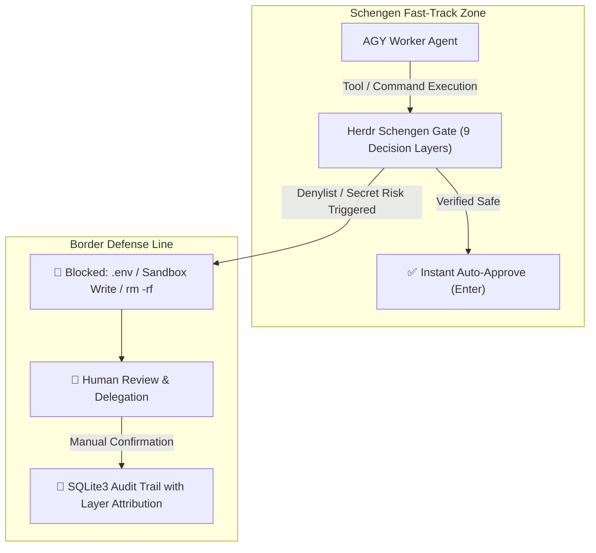

# Herdr Schengen (SmartGate / Trusted Clearance) 🌍🛂🛃

`herdr-schengen` (aliases: `trusted-clearance`, `smartgate`) is an automated **Trusted Clearance & SmartGate** security daemon for **Antigravity (AGY)** and **OpenCode** agents operating in the **Herdr terminal multiplexer** environment.

- **Schengen Fast-Track (Border-Free Flow / SmartGate)**: Verified safe development operations (AST validated) pass border control in **0.1 seconds** without manual confirmation prompts.
- **Strict Denylist & Border Control**: Secret credential access (`.env`, `id_rsa`), Hermes Sandbox write mutations, and destructive commands (`rm -rf`, `sudo`, `git push --force`) are immediately blocked and delegated to human review.
- **Self-Exclusion & Isolation**: The caller pane running the watcher (`HERDR_PANE_ID`) and non-target agent sessions (Hermes, bare shells) are strictly excluded from automated keystroke injection.

---

## ⚙️ Host Runtime Dispatch

This skill is loaded by **both** Antigravity (AGY) and OpenCode agents. Determine
your runtime and follow **only** the matching host-execution section; ignore the
other. All remaining sections (governance, decision layers, border policy) are
shared.

- `ANTIGRAVITY_AGENT=1` / `AI_AGENT=antigravity` → **🟢 AGY-Native Host Execution**.
- `OPENCODE=1` → **🔵 OpenCode-Native Host Execution**.

---

## 🚀 Quick Start (Shared — daemon lifecycle, both hosts)

> **🚨 Mandatory Session-Bound Governance (ADR-003 / ADR-008)**: the watcher MUST
> run as a child of a living host agent session (never detached/orphaned); the
> `is_parent_alive` guard self-terminates it when the host exits. Reload via
> `--reload` (SIGHUP), never by killing the daemon.

```bash
# Guard all target panes (AGY + OpenCode)
python3 ~/.agents/skills/herdr-schengen/scripts/cmd/schengen_watcher.py --target auto

# Enable the private tool-calling semantic inspector (dynamic $(cat ...) judge)
python3 ~/.agents/skills/herdr-schengen/scripts/cmd/schengen_watcher.py --target auto --use-gpt-oss

# Target a specific pane / reload / stop
python3 ~/.agents/skills/herdr-schengen/scripts/cmd/schengen_watcher.py --target wP:p2
python3 ~/.agents/skills/herdr-schengen/scripts/cmd/schengen_watcher.py --reload
python3 ~/.agents/skills/herdr-schengen/scripts/cmd/schengen_watcher.py --reload --target wS:pF
python3 ~/.agents/skills/herdr-schengen/scripts/cmd/schengen_watcher.py --stop --target wS:pF
python3 ~/.agents/skills/herdr-schengen/scripts/cmd/schengen_watcher.py --stop

# Status / history / stats
python3 ~/.agents/skills/herdr-schengen/scripts/cmd/schengen_watcher.py --status
python3 ~/.agents/skills/herdr-schengen/scripts/cmd/schengen_history.py -n 10
python3 ~/.agents/skills/herdr-schengen/scripts/cmd/schengen_history.py --search "git"
python3 ~/.agents/skills/herdr-schengen/scripts/cmd/schengen_history.py --tail 20
python3 ~/.agents/skills/herdr-schengen/scripts/cmd/schengen_history.py -n 5 --json
python3 ~/.agents/skills/herdr-schengen/scripts/cmd/schengen_history.py --paths
python3 ~/.agents/skills/herdr-schengen/scripts/cmd/schengen_history.py --stats
```

---

## 🟢 AGY-Native Host Execution (Antigravity only)

> **Session-Bound Lifetime**: run the watcher as a tracked background task
> (`run_command` / `task-<id>`) in the orchestrating AGY session; re-launch on
> any termination.

```bash
python3 ~/.agents/skills/herdr-schengen/scripts/cmd/schengen_watcher.py --target auto
```

> **Proactive Escalation Heartbeat & Exponential Drain Rule**:
> - Arm a `schedule` heartbeat when idle: exponential `60s → 60s → 120s → 240s → 360s → …` (cap 1800s); reset to 60s on any event.
>   ```json
>   schedule(DurationSeconds=60, Prompt="Check pending escalations queue and drain blocked panes", TimerCondition="any")
>   ```
> - At the start of EVERY turn / wakeup, drain the queue:
>   ```bash
>   python3 ~/.agents/skills/herdr-schengen/scripts/cmd/schengen_history.py --pending
>   ```
> - If a `PENDING` escalation exists, immediately evaluate and prompt the human / auto-resolve.

---

## 🔵 OpenCode-Native Host Execution (OpenCode only)

> **Activation**: install the host plugin once, then start the guard on-demand in
> the specific session you want as host.

```bash
mkdir -p ~/.config/opencode/plugins
cp opencode/plugins/schengen-host.js ~/.config/opencode/plugins/schengen-host.js
# restart OpenCode
```

- `start the schengen guard` → `schengen_start` (spawns the daemon; this session becomes the host).
- `stop the schengen guard` → `schengen_stop`.
- `is the schengen guard running?` → `schengen_status`.
- **die-with-parent**: `tui.lifecycle.onDispose` + `SCHENGEN_STRICT_PARENT=1` kill the daemon when the session closes.
- **watcher-of-the-watcher**: the plugin re-spawns the daemon on crash while `desired`.
- See `opencode/README.md` for config env vars and multi-session behavior.

---

## ⚠️ Known Limitations

- **Pane ID staleness on `herdr pane move`**: `self_pane` (from the inherited
  `HERDR_PANE_ID`) and any `--target <pane>` are captured once at launch. If a
  pane is moved to another workspace it gets a new ID while the watcher's
  inherited ID stays stale, so self-exclusion (or a specific `--target`) silently
  stops matching. **Workaround**: restart the watcher after any `herdr pane move`
  so it re-detects its self pane.

---

## 🧭 Core Governance Architecture & Decision Layers



### 🛡️ 9 Decision Layers Overview (Layer 0 ~ Layer 8)

| Layer ID | Layer Name | Inspection Scope & Policies |
| :--- | :--- | :--- |
| **Layer 0** | `ALLOWLIST` | Human-persisted allowlist regex rules verified by engineers |
| **Layer 1** | `MANAGED_GIT_GUARD` | Managed Git SCM platforms (Forgejo, Gitea, GitHub, GitLab) API queries & issue/PR interactions |
| **Layer 2** | `SHELL_CRITICAL` | Destructive commands (`rm -rf`, `sudo`, `git push --force`, `git reset --hard`, `mkfs`) |
| **Layer 3** | `SANDBOX_GUARD` | Hermes Docker/microVM Sandbox write isolation (`> .hermes/sandboxes/...`, `cp/mv`, `touch`) |
| **Layer 4** | `PYTHON_AST` | Python AST static analysis (`eval()`, `exec()`, sensitive file opens, subprocess mutations) |
| **Layer 5** | `SECRET_GUARD` | Sensitive file access (`.env`, `id_rsa`, `hosts.yml`, `credentials.json`, exfiltration) |
| **Layer 6** | `LLM_INSPECTOR` | L2 AGY Session Subagent (`gpt-oss:120b` native subagent under Antigravity limits) for dynamic substitutions `$(cat ...)` |
| **Layer 7** | `GRAY_ZONE_MATRIX` | Non-VCS Irreversible Mutation Matrix (ADR-004 / SOP-12) with structured decision guidance |
| **Layer 8** | `FAST_TRACK_AST` | Static verified development workflows (`git status`, `mkdir`, `pytest`, `npm run dev`) |

---

## 🛡️ Border Control Policy Summary

| Domain | Fast-Track Auto-Approved (`SAFE`) | Border Control Blocked (`DANGEROUS / MANUAL`) |
| :--- | :--- | :--- |
| **Target Agent** | **AGY and OpenCode (all registered target agent kinds)** | Hermes, bare shells, and caller pane (`self`) 100% excluded |
| **Managed Git SCM** | All `GET` requests, `/issues/...`, `/pulls/...` interactions (POST, PATCH) | Destructive `DELETE` requests (`-X DELETE`, `method='DELETE'`) |
| **Environment / System** | `export PATH="..."` environment variable definitions | Direct mutations to `/etc`, `/System`, `/usr/bin` (`rm`, `chmod`) |
| **Shell Commands** | `git status/diff/add/commit`, `mkdir`, `cd`, `ls`, file edits | `rm -rf`, `sudo`, `su`, `chmod`, `chown`, `git push`, `git reset --hard` |
| **Hermes Sandbox** | Read-only inspection (`cat`, `ls`) | Write mutations (`> .hermes/sandboxes/...`, `cp/mv`, `touch`, `rsync`) |
| **Secrets & Keys** | Template handling (`.env.example`) | `cat .env`, `grep KEY .env`, `id_rsa`, `~/.aws`, `hosts.yml` access |
| **Python AST** | Data processing, linters, `pytest`, allowed Managed Git APIs | External unverified networking, `eval()`, `exec()`, sandbox writes |
