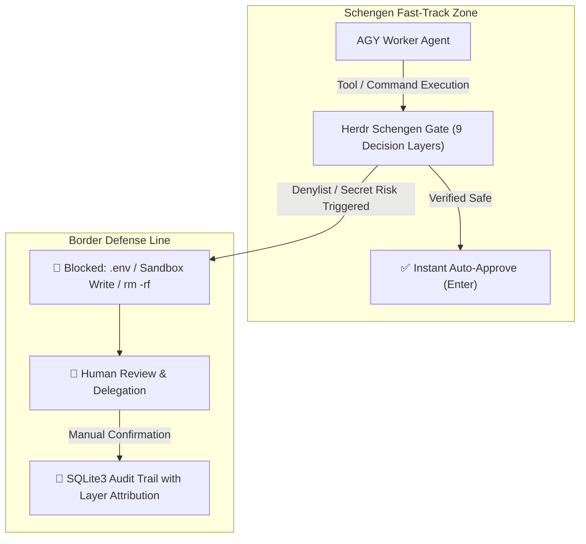

# Herdr Schengen (SmartGate / Trusted Clearance) 🌍🛂🛃

`herdr-schengen` (aliases: `trusted-clearance`, `smartgate`) is an automated **Trusted Clearance & SmartGate** security daemon for **Antigravity (AGY)** and **OpenCode** agents operating in the **Herdr terminal multiplexer** environment.

- **Schengen Fast-Track (Border-Free Flow / SmartGate)**: Verified safe development operations (AST validated) pass border control in **0.1 seconds** without manual confirmation prompts.
- **Strict Denylist & Border Control**: Secret credential access (`.env`, `id_rsa`), Hermes Sandbox write mutations, and destructive commands (`rm -rf`, `sudo`, `git push --force`) are immediately blocked and delegated to human review.
- **Self-Exclusion & Isolation**: The caller pane running the watcher (`HERDR_PANE_ID`) and non-target agent sessions (Hermes, bare shells) are strictly excluded from automated keystroke injection.

---

## ⚙️ Daemon Lifecycle (TUI — single owner)

The guard daemon lifecycle (start/stop/reload) is owned **exclusively by the
Schengen TUI** (`schengen_tui.py`, `Ctrl+T`). There is no other supported way to
start/stop the daemon — direct `schengen_watcher.py --target auto` and the
OpenCode plugin's `schengen_start` are deprecated (issue #114). All remaining
sections (governance, decision layers, border policy) are shared.

---

## 🚀 Quick Start (TUI — daemon lifecycle)

> **🚨 Mandatory Session-Bound Governance (ADR-003 / ADR-008)**: the watcher runs
> die-with-parent under the TUI (`SCHENGEN_STRICT_PARENT=1`); its `is_parent_alive`
> guard self-terminates it when the TUI closes — never orphaned. Start/stop/reload
> is done **only** through the TUI (`Ctrl+T` / `/toggle`), never by direct CLI.

```bash
# Launch the interactive gatekeeper (single daemon lifecycle owner)
~/.local/share/herdr-schengen-tui-venv/bin/python3 ~/code/herdr-schengen/scripts/cmd/schengen_tui.py

# Diagnostics (read-only — NOT lifecycle; the TUI owns start/stop/reload)
python3 ~/.agents/skills/herdr-schengen/scripts/cmd/schengen_watcher.py --status
python3 ~/.agents/skills/herdr-schengen/scripts/cmd/schengen_history.py -n 10
python3 ~/.agents/skills/herdr-schengen/scripts/cmd/schengen_history.py --search "git"
python3 ~/.agents/skills/herdr-schengen/scripts/cmd/schengen_history.py --tail 20
python3 ~/.agents/skills/herdr-schengen/scripts/cmd/schengen_history.py -n 5 --json
python3 ~/.agents/skills/herdr-schengen/scripts/cmd/schengen_history.py --paths
python3 ~/.agents/skills/herdr-schengen/scripts/cmd/schengen_history.py --pending
python3 ~/.agents/skills/herdr-schengen/scripts/cmd/schengen_history.py --stats
```

---

## 🗑️ Deprecated: Non-TUI Host Execution (issue #114)

The former per-runtime daemon lifecycle paths are **deprecated**:

- **AGY-Native** (`schengen_watcher.py --target auto` run as a tracked background task)
- **OpenCode-Native** (`schengen_start` / `schengen_stop` / `schengen_status` plugin tools)

Use the **Schengen TUI (`Ctrl+T`)** as the single daemon lifecycle owner instead.

The OpenCode plugin (`~/.config/opencode/plugins/schengen-host.js`) still provides
the permission.reply pipeline (permission.asked channel emit + decision poller);
it no longer spawns the daemon nor surfaces escalations. Install it once:

```bash
mkdir -p ~/.config/opencode/plugins
cp opencode/plugins/schengen-host.js ~/.config/opencode/plugins/schengen-host.js
# restart OpenCode
```

---

## ⚠️ Known Limitations

- **Pane ID staleness on `herdr pane move`**: `self_pane` (from the inherited
  `HERDR_PANE_ID`) and any `--target <pane>` are captured once at launch. If a
  pane is moved to another workspace it gets a new ID while the watcher's
  inherited ID stays stale, so self-exclusion (or a specific `--target`) silently
  stops matching. **Workaround**: restart the watcher after any `herdr pane move`
  so it re-detects its self pane.

---

## 🧭 Core Governance Architecture & Decision Layers



### 🛡️ 9 Decision Layers Overview (Layer 0 ~ Layer 8)

| Layer ID | Layer Name | Inspection Scope & Policies |
| :--- | :--- | :--- |
| **Layer 0** | `ALLOWLIST` | Human-persisted allowlist regex rules verified by engineers |
| **Layer 1** | `MANAGED_GIT_GUARD` | Managed Git SCM platforms (Forgejo, Gitea, GitHub, GitLab) API queries & issue/PR interactions |
| **Layer 2** | `SHELL_CRITICAL` | Destructive commands (`rm -rf`, `sudo`, `git push --force`, `git reset --hard`, `mkfs`) |
| **Layer 3** | `SANDBOX_GUARD` | Hermes Docker/microVM Sandbox write isolation (`> .hermes/sandboxes/...`, `cp/mv`, `touch`) |
| **Layer 4** | `PYTHON_AST` | Python AST static analysis (`eval()`, `exec()`, sensitive file opens, subprocess mutations) |
| **Layer 5** | `SECRET_GUARD` | Sensitive file access (`.env`, `id_rsa`, `hosts.yml`, `credentials.json`, exfiltration) |
| **Layer 6** | `LLM_INSPECTOR` | L2 AGY Session Subagent (`gpt-oss:120b` native subagent under Antigravity limits) for dynamic substitutions `$(cat ...)` |
| **Layer 7** | `GRAY_ZONE_MATRIX` | Non-VCS Irreversible Mutation Matrix (ADR-004 / SOP-12) with structured decision guidance |
| **Layer 8** | `FAST_TRACK_AST` | Static verified development workflows (`git status`, `mkdir`, `pytest`, `npm run dev`) |

---

## 🛡️ Border Control Policy Summary

| Domain | Fast-Track Auto-Approved (`SAFE`) | Border Control Blocked (`DANGEROUS / MANUAL`) |
| :--- | :--- | :--- |
| **Target Agent** | **AGY and OpenCode (all registered target agent kinds)** | Hermes, bare shells, and caller pane (`self`) 100% excluded |
| **Managed Git SCM** | All `GET` requests, `/issues/...`, `/pulls/...` interactions (POST, PATCH) | Destructive `DELETE` requests (`-X DELETE`, `method='DELETE'`) |
| **Environment / System** | `export PATH="..."` environment variable definitions | Direct mutations to `/etc`, `/System`, `/usr/bin` (`rm`, `chmod`) |
| **Shell Commands** | `git status/diff/add/commit`, `mkdir`, `cd`, `ls`, file edits | `rm -rf`, `sudo`, `su`, `chmod`, `chown`, `git push`, `git reset --hard` |
| **Hermes Sandbox** | Read-only inspection (`cat`, `ls`) | Write mutations (`> .hermes/sandboxes/...`, `cp/mv`, `touch`, `rsync`) |
| **Secrets & Keys** | Template handling (`.env.example`) | `cat .env`, `grep KEY .env`, `id_rsa`, `~/.aws`, `hosts.yml` access |
| **Python AST** | Data processing, linters, `pytest`, allowed Managed Git APIs | External unverified networking, `eval()`, `exec()`, sandbox writes |
