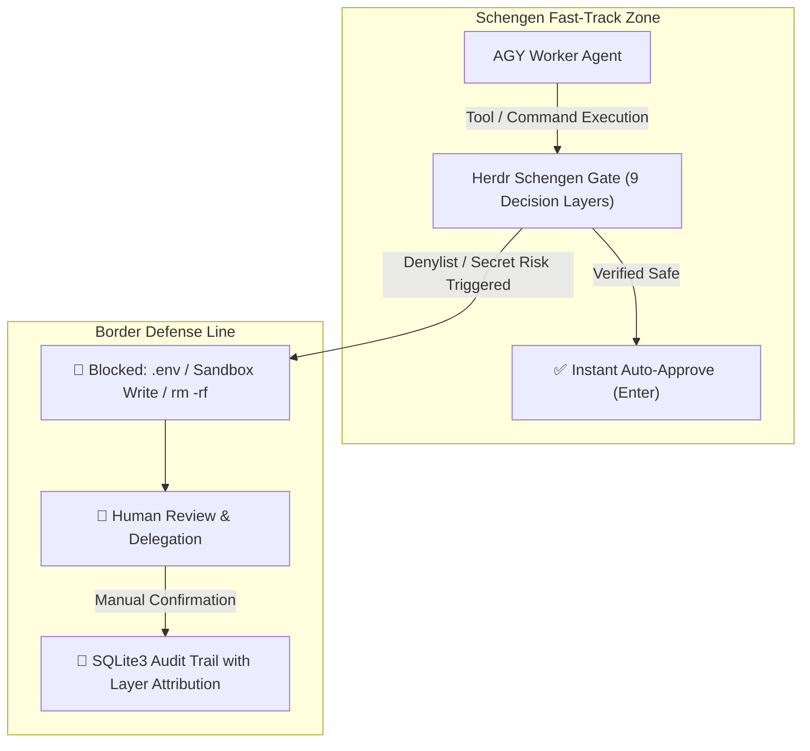

# Herdr Schengen (SmartGate / Trusted Clearance) 🌍🛂🛃

`herdr-schengen` (aliases: `trusted-clearance`, `smartgate`) is an automated **Trusted Clearance & SmartGate** security daemon for **Antigravity (AGY)** agents operating in the **Herdr terminal multiplexer** environment.

- **Schengen Fast-Track (Border-Free Flow / SmartGate)**: Verified safe development operations (AST validated) pass border control in **0.1 seconds** without manual confirmation prompts.
- **Strict Denylist & Border Control**: Secret credential access (`.env`, `id_rsa`), Hermes Sandbox write mutations, and destructive commands (`rm -rf`, `sudo`, `git push --force`) are immediately blocked and delegated to human review.
- **Self-Exclusion & Isolation**: The caller pane running the watcher (`HERDR_PANE_ID`) and non-target agent sessions (Hermes, bare shells) are strictly excluded from automated keystroke injection.

---

## 🚀 Quick Start & AGY Execution Models

### 1. AGY-Native Session Clearance & Auto-Recovery Mandate (Method A, Primary Model)
> **🚨 Mandatory Session-Bound Governance (ADR-003 / SOP-13)**:
> - **Session-Bound Lifetime**: Schengen watcher **MUST** run as a tracked background task (`run_command` / `task-<id>`) directly within the orchestrating **AGY agent session**. It must never run detached or orphaned.
> - **Proactive Auto-Recovery**: Whenever the watcher daemon terminates (due to crash, patch reload, or task completion), the active AGY agent session **MUST immediately re-launch the daemon** (`--target auto`) before proceeding with other work.
> - **Graceful Dynamic Reload**: When patching code or updating rulesets, **NEVER** kill the daemon. Always invoke `python3 .../schengen_watcher.py --reload` to trigger in-process `SIGHUP` reload via `importlib.reload()`.

```bash
# Main command (AGY-native streaming background task mode)
python3 ~/.agents/skills/herdr-schengen/scripts/schengen_watcher.py --target auto

# In-process graceful hot reload (Zero downtime, no daemon restart)
python3 ~/.agents/skills/herdr-schengen/scripts/schengen_watcher.py --reload

# Target-specific graceful reload or stop
python3 ~/.agents/skills/herdr-schengen/scripts/schengen_watcher.py --reload --target wS:pF
python3 ~/.agents/skills/herdr-schengen/scripts/schengen_watcher.py --stop --target wS:pF
```

### 2. Enable Private Tool-Calling Semantic Inspector
```bash
python3 ~/.agents/skills/herdr-schengen/scripts/schengen_watcher.py --target auto --use-gpt-oss
```

### 3. Target a Specific Herdr Pane
```bash
python3 ~/.agents/skills/herdr-schengen/scripts/schengen_watcher.py --target wP:p2
```

### 4. Check SmartGate Status & Monitored Panes
```bash
python3 ~/.agents/skills/herdr-schengen/scripts/schengen_watcher.py --status
```

### 5. Inspect Recent Approvals, Search, & Tail Logs (Agent CLI Tools)
```bash
# View recent 10 audit logs with layer attribution
python3 ~/.agents/skills/herdr-schengen/scripts/schengen_history.py -n 10

# Search past approvals / rejections by keyword
python3 ~/.agents/skills/herdr-schengen/scripts/schengen_history.py --search "git"

# Tail live daemon logs safely without raw shell tail
python3 ~/.agents/skills/herdr-schengen/scripts/schengen_history.py --tail 20

# Output structured JSON for AI agent parsing
python3 ~/.agents/skills/herdr-schengen/scripts/schengen_history.py -n 5 --json

# Discover all SmartGate state & DB paths
python3 ~/.agents/skills/herdr-schengen/scripts/schengen_history.py --paths
```

### 6. Stop SmartGate Daemon
```bash
python3 ~/.agents/skills/herdr-schengen/scripts/schengen_watcher.py --stop
```

### 7. Inspect Audit Statistics & Review Board
```bash
python3 ~/.agents/skills/herdr-schengen/scripts/schengen_history.py --stats
```

### 8. Proactive Escalation Heartbeat & Exponential Drain Rule (Agent Skill Directive)
> **🚨 Proactive Escalation Polling & Exponential Idle Defense Mandate**:
> - **Exponential Wakeup Timer via `schedule` tool**: Whenever an orchestrator AGY session enters an idle phase while waiting for sibling/worker panes (`dev`, `wS:pF`), the agent **MUST arm a heartbeat timer** using the native agent tool with exponential intervals:
>   - **Interval Progression**: `60s` $\rightarrow$ `60s` $\rightarrow$ `120s` $\rightarrow$ `240s` $\rightarrow$ `360s` $\rightarrow$ ... (Exponential Backoff with upper cap of **30 minutes / 1800s**).
>   - **Reset on Event**: Any detected escalation, user message, or worker activity resets the heartbeat interval back to `60s`.
>   ```json
>   schedule(DurationSeconds=60, Prompt="Check pending escalations queue and drain blocked panes", TimerCondition="any")
>   ```
> - **Turn-Start Queue Drain Hook**: At the beginning of **EVERY** turn or timer wakeup, the agent MUST execute:
>   ```bash
>   python3 ~/.agents/skills/herdr-schengen/scripts/schengen_history.py --pending
>   ```
> - **Immediate Delegation**: If any active `PENDING` escalation is discovered for a living session, the agent must immediately evaluate and prompt the human / auto-resolve rather than waiting passively.

---

## 🧭 Core Governance Architecture & Decision Layers



### 🛡️ 9 Decision Layers Overview (Layer 0 ~ Layer 8)

| Layer ID | Layer Name | Inspection Scope & Policies |
| :--- | :--- | :--- |
| **Layer 0** | `ALLOWLIST` | Human-persisted allowlist regex rules verified by engineers |
| **Layer 1** | `MANAGED_GIT_GUARD` | Managed Git SCM platforms (Forgejo, Gitea, GitHub, GitLab) API queries & issue/PR interactions |
| **Layer 2** | `SHELL_CRITICAL` | Destructive commands (`rm -rf`, `sudo`, `git push --force`, `git reset --hard`, `mkfs`) |
| **Layer 3** | `SANDBOX_GUARD` | Hermes Docker/microVM Sandbox write isolation (`> .hermes/sandboxes/...`, `cp/mv`, `touch`) |
| **Layer 4** | `PYTHON_AST` | Python AST static analysis (`eval()`, `exec()`, sensitive file opens, subprocess mutations) |
| **Layer 5** | `SECRET_GUARD` | Sensitive file access (`.env`, `id_rsa`, `hosts.yml`, `credentials.json`, exfiltration) |
| **Layer 6** | `LLM_INSPECTOR` | L2 AGY Session Subagent (`gpt-oss:120b` native subagent under Antigravity limits) for dynamic substitutions `$(cat ...)` |
| **Layer 7** | `GRAY_ZONE_MATRIX` | Non-VCS Irreversible Mutation Matrix (ADR-004 / SOP-12) with structured decision guidance |
| **Layer 8** | `FAST_TRACK_AST` | Static verified development workflows (`git status`, `mkdir`, `pytest`, `npm run dev`) |

---

## 🛡️ Border Control Policy Summary

| Domain | Fast-Track Auto-Approved (`SAFE`) | Border Control Blocked (`DANGEROUS / MANUAL`) |
| :--- | :--- | :--- |
| **Target Agent** | **AGY (`agent: "agy"`) panes only** | Hermes, bare shells, and caller pane (`self`) 100% excluded |
| **Managed Git SCM** | All `GET` requests, `/issues/...`, `/pulls/...` interactions (POST, PATCH) | Destructive `DELETE` requests (`-X DELETE`, `method='DELETE'`) |
| **Environment / System** | `export PATH="..."` environment variable definitions | Direct mutations to `/etc`, `/System`, `/usr/bin` (`rm`, `chmod`) |
| **Shell Commands** | `git status/diff/add/commit`, `mkdir`, `cd`, `ls`, file edits | `rm -rf`, `sudo`, `su`, `chmod`, `chown`, `git push`, `git reset --hard` |
| **Hermes Sandbox** | Read-only inspection (`cat`, `ls`) | Write mutations (`> .hermes/sandboxes/...`, `cp/mv`, `touch`, `rsync`) |
| **Secrets & Keys** | Template handling (`.env.example`) | `cat .env`, `grep KEY .env`, `id_rsa`, `~/.aws`, `hosts.yml` access |
| **Python AST** | Data processing, linters, `pytest`, allowed Managed Git APIs | External unverified networking, `eval()`, `exec()`, sandbox writes |
