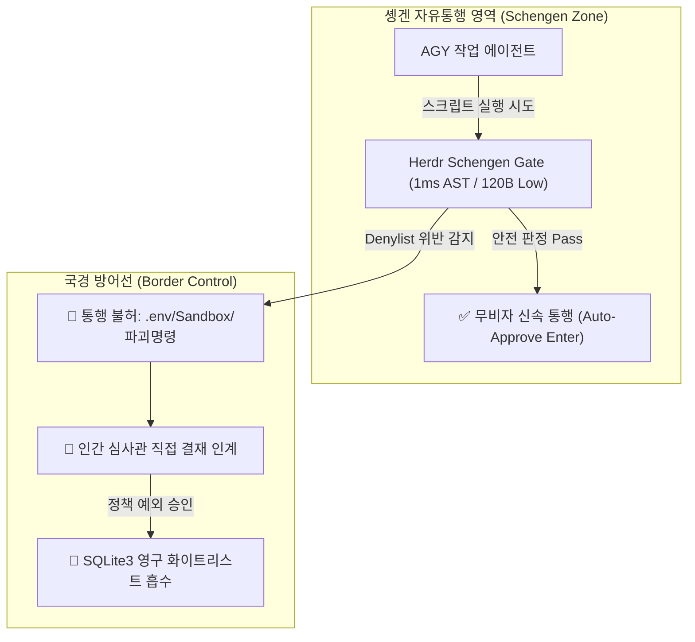

# Herdr Schengen (Aliases: Trusted Clearance / SmartGate) 🌍🛂🛃

`herdr-schengen`(별칭: `trusted-clearance`, `smartgate`)은 **Herdr 터미널 멀티플렉서** 환경에서 활동하는 AGY 에이전트들을 위한 **"솅겐 자유통행 조약 & 신뢰 통관 스마트게이트(Trusted Clearance SmartGate)"** 시스템입니다.

- **솅겐 자유통행 & 스마트게이트 (Border-Free Flow / SmartGate)**: 검증된 일상적인 안전 작업(AST 검증 통과)에 대해서는 번거로운 국경 검문(승인 팝업 대기) 없이 **0.1초 만에 스마트게이트를 열어 자동 통과(Auto-Approve)**를 허용합니다.
- **최소 비자 & 위험 통제 (Strict Denylist)**: 시크릿 파일 탈취(`.env`, `id_rsa`), Hermes Sandbox 쓰기 침범, 시스템 파괴 명령(`rm -rf`) 등 국경 위반 행위는 즉각 통행을 불허하고 **인간 심사관에게 결재를 인계**합니다.
- **Hermes 및 자가 패널 격리**: Hermes 세션과 가드를 실행한 자기 자신 패널(Self-Caller)은 100% 대상에서 배제하여 안전한 통제 경계를 유지합니다.

---

## 🚀 빠른 실행 (Quick Start & Aliases)

### 1. 전역 AGY 솅겐 자유통행 시작 (기본: Reasoning Low, Auto Target)
```bash
# 공식 메인 명령어
python3 ~/.agents/skills/herdr-schengen/scripts/schengen_watcher.py --target auto

# 별칭(Alias)으로도 동일하게 실행 가능
python3 ~/.agents/skills/herdr-schengen/scripts/trusted_clearance.py --target auto
```

### 2. GPT-OSS 120B 프라이빗 시맨틱 심사관 연동 (Google One 쿼터 소모 0)
```bash
python3 ~/.agents/skills/herdr-schengen/scripts/schengen_watcher.py --target auto --use-gpt-oss
```

### 3. 특정 패널만 지정하여 통행 허가
```bash
python3 ~/.agents/skills/herdr-schengen/scripts/schengen_watcher.py --target wP:p2
```

### 4. 솅겐 게이트 안전 중단 (Stop Singleton)
```bash
python3 ~/.agents/skills/herdr-schengen/scripts/schengen_watcher.py --stop
```

### 5. 출입국 통행 감사 로그 및 통계 조회 (Review Board)
```bash
python3 ~/.agents/skills/herdr-schengen/scripts/schengen_watcher.py --stats
```

---

## 🧭 핵심 3대 거버넌스 철학



1. **솅겐 자유통행 (Schengen Border-Free Travel)**:
   - 신뢰 영역 내에서 개발 에이전트의 흐름(Flow)이 끊기지 않도록, 검증된 안전 명령어는 즉시 통과시킵니다.
2. **엄격한 싱글톤 무결성 (`fcntl.flock`)**:
   - `~/.local/state/herdr-schengen/schengen.lock`을 통해 단 하나의 솅겐 게이트키퍼만이 국경을 관제하며 중복 실행을 원천 차단합니다.
3. **독립된 Reasoning 이원화 (Worker Medium vs Judge Low)**:
   - 메인 AGY는 Gemini 3.7 Medium으로 깊은 개발 설계를 수행하고, 솅겐 게이트는 사내 120B Low Reasoning으로 200ms 초저지연 심사를 수행합니다.

---

## 🛡️ 정밀 국경 통제 정책 (Schengen Border Rules)

| 영역 | 무비자 통과 대상 (`SAFE / APPROVED`) | 국경 통제/차단 대상 (`DANGEROUS / BLOCKED`) |
| :--- | :--- | :--- |
| **대상 에이전트** | **AGY (`agent: "agy"`) 세션 전용** | Hermes, 기타 CLI 에이전트 및 가드 실행 패널(Self)은 100% 제외 |
| **사내 SCM (Forgejo)** | 1. `GET` 요청 전체 허용<br>2. `/issues/...` 엔드포인트 상호작용 (POST, PATCH, PUT) 허용 | `DELETE` 요청 전체 (`-X DELETE`, `method='DELETE'`) 차단 |
| **환경/시스템** | `export PATH="/opt/homebrew/bin:/usr/bin:/bin"` 등 PATH 환경변수 설정 허용 | `/etc`, `/System`, `/usr/bin` 등 시스템 디렉터리 직접 조작/삭제 (`rm`, `chmod`) |
| **Shell Commands** | `git status/diff/add/commit`, `mkdir`, `cd`, `ls`, 문서 생성/편집 | `rm -rf`, `sudo`, `su`, `chmod`, `chown`, `git push`, `git reset --hard` |
| **Hermes Sandbox** | 샌드박스 내부 단순 조회/읽기 (`cat / ls` 등) | 샌드박스 경로 대상 쓰기 (`> .hermes/sandboxes/...`, `cp/mv`, `touch`, `rsync`) |
| **Secrets & Keys** | `.env.example` 등 템플릿 파일 다루기 | `cat .env`, `grep KEY .env`, `id_rsa`, `~/.aws`, `~/.config/gh/hosts.yml` 접근 |
| **Python AST** | 데이터 가공, 린터/테스트(`pytest`), 허용된 Forgejo API 호출 | `requests`/`socket` 외부 인터넷 통신, `eval()`, `exec()`, 샌드박스 파일 쓰기 |
