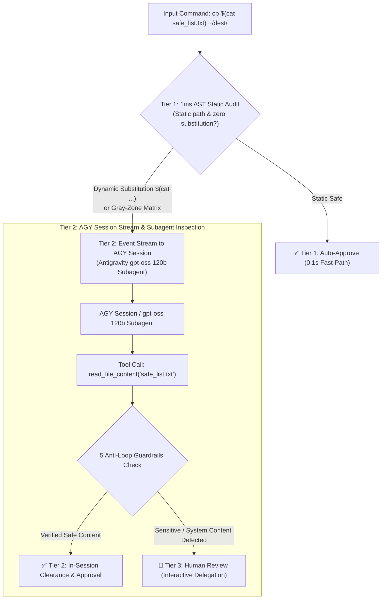

# ADR-002: Dynamic Substitution & Gray-Zone Escalation via AGY Session Stream & Antigravity Native Subagents

- **Status**: Accepted (Updated)
- **Date**: 2026-08-18 (Updated 2026-08-19)
- **Context**: Herdr SmartGate / Schengen Security Architecture
- **Authors**: `bot-agy-macmini <bot-agy-macmini@noreply.localhost>`

---

## 🧭 1. Context & Clarification

In autonomous coding agent workflows, shell commands frequently leverage inline dynamic substitutions (e.g. `cp $(cat target_list.txt) ~/dest/` or `rm $(find . -name "*.tmp")`).

Static analysis (1ms AST/regex matching) faces an **inherent blind spot** known as the **"Indirect Payload Injection" vulnerability**:
1. A file named `safe_list.txt` appears benign on the command line.
2. However, runtime contents inside `safe_list.txt` could contain sensitive system paths (`/etc/shadow`), private SSH keys (`~/.ssh/id_rsa`), or secret configurations (`.env`).
3. If auto-approved naively, the shell expands the dynamic payload at runtime, exfiltrating or modifying sensitive files without human oversight.

### ⚠️ Infrastructure Boundary Clarification:
* **SALADA-NAS**: Storage, private Git (`salada-git`), and core services infrastructure. SALADA-NAS does **NOT** host LLM inference endpoints.
* **Antigravity (AGY)**: Natively supports `gpt-oss 120b` and other specialized subagent models under Antigravity's model quota/weekly limits.
* **No External LLM Endpoints**: Herdr Schengen daemon does not make HTTP calls to external or NAS endpoints. All semantic escalations stream directly into the active **AGY Session**.

---

## 🎯 2. Decision: 3-Tier Inspection Pipeline with AGY Session Streaming

We adopt a **3-tier evaluation architecture** uniting deterministic static speed with in-session AGY subagent semantic inspection:

---

## 🛡️ 3. 5 Anti-Loop & Anti-Hang Guardrails (Preventing Infinite Redirects)

To prevent recursive loops, blocking I/O hangs, and memory exhaustion during subagent inspection:

| # | Guardrail | Implementation | Protected Vulnerability |
| :--- | :--- | :--- | :--- |
| **1** | **Strict Max Hops (2)** | Subagent tool loop hard limit: `max_hops = 2`. Bail out to Tier 3 on exceed. | Nested dynamic substitution recursion loops (`$(cat $(cat $(cat ...)))`). |
| **2** | **Native Direct I/O** | `open()` via Python stdlib; no shell/subprocess invocation. | Self-reentrant triggers / shell prompt re-execution. |
| **3** | **Regular File Check (`S_ISREG`)** | `stat.S_ISREG` validation + 8KB max read limit (`max_bytes=8192`). | Blocking named pipes (FIFO), socket hangs, and `/dev/zero` infinite stream OOM. |
| **4** | **Symlink Canonicalization** | `Path.resolve()` + `visited_paths` set loop detection. | Symlink circular reference loops (`a.txt -> b.txt -> a.txt`). |
| **5** | **Fail-Safe to Human** | Bail-out to `MANUAL_DELEGATED` on uncertainty or parameter risk. | Infinite deliberation / unhandled runtime exceptions. |

---

## 📊 4. Consequences & Trade-Offs

- **Positives**:
  - **Zero External HTTP Fragility**: Eliminates external HTTP endpoint timeouts or network connection failures.
  - **Native AGY Ecosystem Cohesion**: Leverages Antigravity's built-in `gpt-oss 120b` subagent model under dedicated weekly limits.
  - **Zero Friction**: Legitimate dynamic operations pass seamlessly after in-session subagent verification.
  - **Deterministic Safety**: 1ms AST fast-track for daily commands + rigorous in-session inspection for dynamic substitutions.
- **Negatives**:
  - In-session subagent inspection consumes Antigravity weekly model quota when dynamic substitutions are processed.
