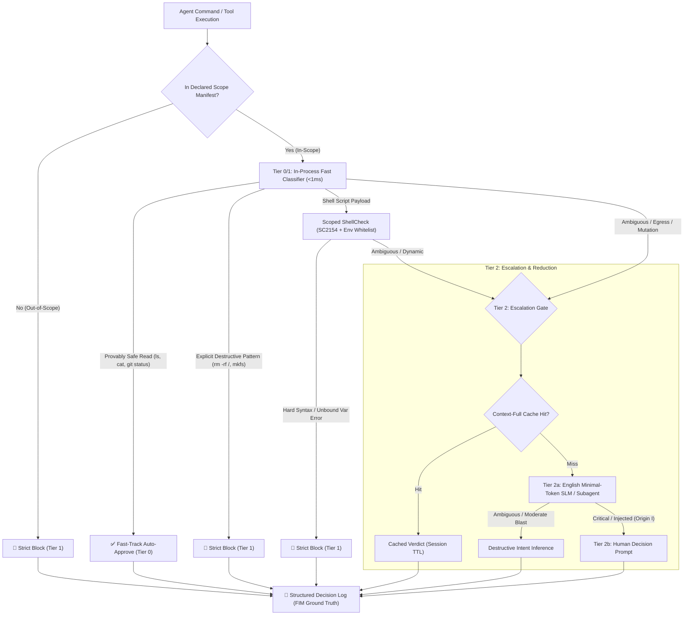

# ADR-006: Destructive Intent Taxonomy & Hybrid SAST Pre-Execution Security Gate Architecture

- **Status**: Accepted
- **Date**: 2026-08-21
- **Deciders**: SaladaQoo (Human Lead), Antigravity (AGY Orchestrator), Hermes DevOps Lead (`devops-hermes`), Hermes CISO (`ciso-hermes`)
- **Consulted**: `ciso-reviewer`, `devops-reviewer`, `english-reviewer`
- **Related Documents**: `ADR-001`, `ADR-002`, `ADR-003`, `ADR-004`, `ADR-005`, `AGENTS.md` (Rules 10-13), `SOP-11`, `SOP-12`

---

## 1. Context & Problem Statement

As autonomous coding agents (AGY, Hermes, Codex) operate within terminal multiplexers (`Herdr`) and execute shell/Python commands autonomously, a new class of **Agent Runtime Vulnerabilities** has emerged that traditional application security models (SQL injection, XSS) fail to address:

1. **Privilege Abuse & Irreversible Side-effects**:
   - Coding agents run with valid developer/shell permissions. A single defect (e.g. unbound variable `$BUILD_DIR` executing `rm -rf "$BUILD_DIR/*"`) can wipe the host filesystem.
2. **Mismatch with Existing Security Paradigms**:
   - **File Integrity Monitoring (Tripwire, Samhain)**: Detective / post-execution file hash polling that only reports damage *after* files have already been modified or deleted.
   - **Traditional SAST (Bandit, Semgrep CLI)**: Designed for project-wide batch scanning with significant cold-start latency (200~800ms), violating the terminal Fast-Track (<0.1s) SLA.
3. **LLM Cost & Latency Bottlenecks**:
   - Routing every terminal keystroke or command to a large LLM causes extreme latency (TTFT/TPOT) and prohibitive token consumption, stalling developer productivity.

---

## 2. Decision & Architecture

Through a 3-way Socratic Dialectic deliberation between AGY Orchestrator, DevOps Platform Lead, and CISO Security Lead, we establish the **Destructive Intent 2D Taxonomy** and the **Layered Hybrid Pre-Execution Gate Architecture**.



---

## 3. Core Architectural Specifications

### A. Destructive Intent 2D Taxonomy Matrix
Replaces flat intent tagging with an **Origin × Consequence + Mechanism** 3-axis matrix:

| Axis | Dimension Values | Description | Governance Policy |
| :--- | :--- | :--- | :--- |
| **Origin** | • **`H` (Human-directed)**<br/>• **`A` (Agent-reasoned)**<br/>• **`I` (Injected/Prompt Hijack)**<br/>• **`E` (Emergent/Latent)** | • Explicit user input<br/>• Autonomous agent reasoning<br/>• Third-party prompt injection<br/>• Unbound variables / unintended side-effects | • `H`: Default trust with advisory warnings<br/>• `A`: Gate validation target<br/>• `I`: Mandatory human review (Tier 2b)<br/>• `E`: ShellCheck & AST high-priority defense |
| **Consequence** | • **`DEST` (Data Destruction)**<br/>• **`EXFIL` (Data Exfiltration)**<br/>• **`INT` (Integrity/Silent Tamper)**<br/>• **`AVAIL` (Availability/DoS)**<br/>• **`PERS` (Persistence/Backdoor)** | • File deletion, disk format<br/>• Sensitive data egress (`curl -d @.env`)<br/>• Silent config/code contamination<br/>• Fork bombs, CPU/RAM starvation<br/>• Privilege escalation, SSH backdoor | Immediate block if blast radius extends outside the declared workspace scope |
| **Mechanism** | `unbound-var`, `eval`, `subshell($())`, `obfuscation(base64)`, `pipe-chaining(&&/|)`, `nested-interpreter(python -c)` | Execution mechanism tag | Used for static parser routing & AST classification rules |

---

### B. SAST Pre-Filters & Tool Latency SLAs

| Tool / Engine | Execution Mode | Latency Budget | Role & Governance Rules |
| :--- | :--- | :--- | :--- |
| **In-process AST/Regex** | Native Python memory parser | **< 1ms** | Core Fast-Track (<0.1s). Instantly clears benign reads and blocks explicit destructive patterns. |
| **ShellCheck** | Pinned static binary (~2MB) | **20 ~ 80ms** | Evaluates shell payloads. Scoped strictly to **SC2154 (Unbound Variables)** with runtime environment variable whitelist. |
| **Semgrep** | Tier 2 Escalation (CLI/Daemon) | **200 ~ 800ms** | Excluded from the 0.1s Fast-Track. Used for deep semantic inspection on ambiguous/blast-radius mutations. Rules versioned in-repo YAML. |
| **Bandit (Python SAST)** | **Deferred (Phase 4)** | N/A | Deferred to maintain atomic rollout simplicity. Inline `python -c` scripts route to Tier 2 Escalation by default. |

---

### C. Pre-Execution Gate vs Post-Execution FIM (Tripwire/Samhain)

* **Architectural Distinction**:
  * **FIM (Tripwire, Samhain)**: Detective post-execution tool monitoring file hashes/inodes. Alerts only *after* damage has occurred.
  * **Schengen Gate**: Preventive pre-execution gate intercepting commands at the PTY boundary. Blocks destructive mutations 0.1s *before* execution.
* **Telemetry Synergy**:
  * Schengen Gate emits structured decision logs (`session_id`, `agent_id`, `command_bytes`, `origin`, `verdict`), providing FIM and host security systems with verified **"Ground Truth Execution Intent"**.

---

### D. English Minimal-Token Few-Shot Prompting & Context-Full Cache

* **LLM Inspector Optimization**:
  * Uses English-only, minimal-token prompts executed via an isolated subagent/SLM to maximize token efficiency and minimize TTFT/TPOT latency.
* **Context-Full Cache Key**:
  * Verdicts are cached per session to achieve $O(1)$ lookup for repetitive commands:
    $$\text{CacheKey} = \text{SHA256}(\text{raw\_cmd} + \text{cwd} + \text{env\_fingerprint} + \text{scope\_root} + \text{agent\_id} + \text{origin} + \text{ruleset\_version})$$

---

### E. Fail-Safe Policies & Scope Manifest

1. **Fail-Mode Boundary**:
   * **Fail-OPEN**: Provably side-effect-free, in-workspace local reads (`ls`, `cat src/`, `git status`) fail-OPEN with a visible `[GATE DEGRADED]` terminal banner.
   * **Fail-CLOSED**: Network egress (`curl`, `ssh`), sensitive path reads (`.env`, `~/.ssh`), and filesystem mutations fail-CLOSED on daemon error.
2. **Scope Manifest (Zero-Config Default)**:
   * Defaults to the current git repository root. Scope expansions (e.g. accessing `/var` or network egress) require explicit 1-time human approval.

---

## 4. 5-Phase Phased Rollout Strategy

```
[Phase 0: Shadow/Observe] ──► [Phase 1: ShellCheck Scoped] ──► [Phase 2: Semgrep Minimal] ──► [Phase 3: LLM Inspector] ──► [Phase 4: Bandit Review]
  - Log-only counterfactual     - SC2154 hard errors           - 3~5 core YAML rules          - English Few-shot SLM       - Python AST specialized
  - Establish FP baseline       - Agent env whitelist          - Tier 2 escalation path        - Context-full cache on      - Telemetry validation
```

* **Kill-Switch**:
  * If False Positive rate exceeds 1~2%, an alert is triggered with human-approved one-click fallback to Phase 0 Shadow Mode (`SCHENGEN_SHADOW_MODE=1`).

---

## 5. Consequences & Impact

### Positive
- **Guaranteed Zero Unhandled Blast Radius**: Automatic interception of unset variable disasters (`E × DEST`) and prompt injections (`I`).
- **Fast-Track SLA Preserved**: Pure in-process (<1ms) and scoped ShellCheck (<80ms) guarantee frictionless agent velocity.
- **Auditable Provenance**: Complete structured event logs recorded for SCM and FIM audit integration.

---

## 6. References
- `ADR-004: Non-VCS Irreversible Mutation Governance`
- `ADR-005: Autonomous Multi-Agent Orchestration & Deadlock Defense Protocol`
- `AGENTS.md: Rules 10-13`
