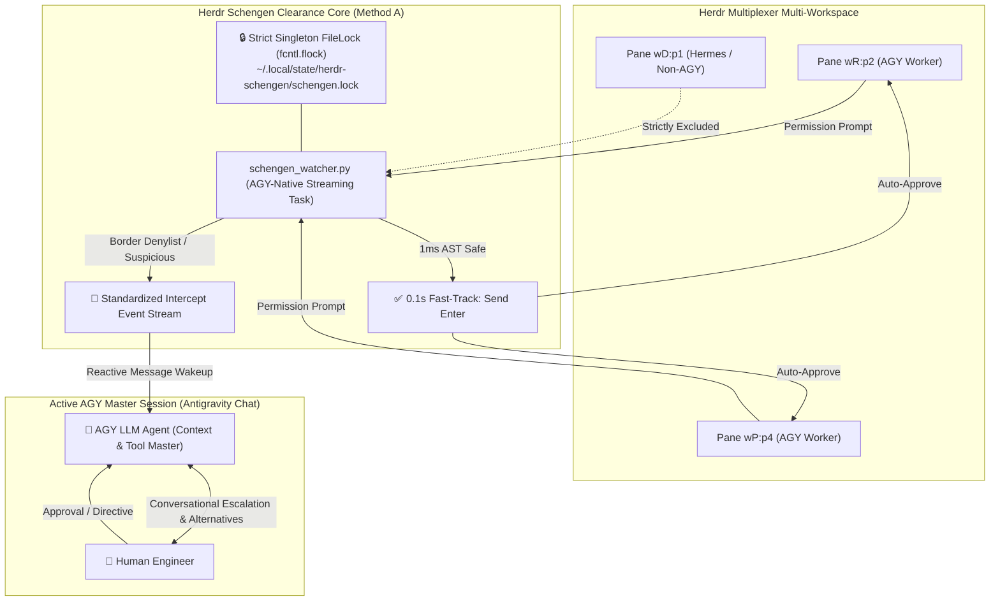

# ADR-003: AGY-Native Task Integration, Single-Session Authority & Conversational Escalation

- **Status**: Evolved (AGY-exclusive wording superseded by ADR-008; daemon lifecycle owned by the TUI per ADR-009 / Issue #114)
- **Date**: 2026-08-18
- **Context**: Herdr SmartGate / Schengen Security Architecture
- **Authors**: `bot-agy-macmini <bot-agy-macmini@noreply.localhost>`

---

## 🧭 1. Context & Problem Statement

The core goal of **Herdr Schengen (SmartGate / Trusted Clearance)** is to achieve an autonomous, border-free flow for safe developer actions while defending critical security boundaries (secrets, `.env`, `rm -rf`, sandbox mutations).

During runtime evaluation, two contrasting execution modes were analyzed:
1. **Isolated OS Daemon (`--daemon`)**:
   - Detached via `os.fork()`.
   - **Critical Flaw**: Complete detachment from the active **AGY LLM Agent Session**. When a border risk is intercepted (`MANUAL_DELEGATED`), the daemon merely stops key injection and sends an OS/Herdr notification. The primary AGY agent cannot participate in the conversational loop, explain the danger, or propose safe alternatives to the human user.
2. **AGY-Native Background Task / Subagent (Method A, Primary Design Intent)**:
   - Runs directly under the AGY session's task orchestration.
   - Real-time stdout stream emits structured intercept events (`[BORDER_CONTROL_INTERCEPT]`), enabling Antigravity's reactive messaging to wake up the main AGY session for conversational delegation.

---

## 🎯 2. Architectural Decisions



---

### Decision 1: AGY-Native Task Execution as the Mandatory Runtime Model
- `schengen_watcher.py --target auto` executes strictly as a foreground streaming process within an active Antigravity (AGY) agent session (`ANTIGRAVITY_AGENT=1` or `AI_AGENT=antigravity`).
- **Code Enforcement**: `verify_agy_runtime_environment()` rejects execution in standalone shell or detached daemon modes at the entrypoint (`[SCHENGEN_FATAL]`).
- **Architectural Boundary**:
  - **Security Core (Process-Agnostic)**: Deterministic 1ms AST, dangerous command denylist, Bitwarden/secret isolation, sandbox protection, and private LLM semantic evaluator operate deterministically.
  - **Escalation & Clearance UX (AGY-Session-Exclusive)**: Conversational escalation, reactive message wakeup on intercept (`[BORDER_CONTROL_INTERCEPT]`), and automated key injection are strictly bound to the active AGY master session.
- **Orphan Process Protection**: Watcher monitors parent process liveness (`is_parent_alive()`). If the parent AGY session exits or disconnects, the watcher terminates immediately to prevent unsupervised headless key injection.

### Decision 2: Strict Single-Session FileLock Authority (`fcntl.flock`)
- Only **one AGY session** across the entire Herdr server may hold the clearance lock (`~/.local/state/herdr-schengen/schengen.lock`).
- Prevents split-brain race conditions, concurrent keystroke collisions, and redundant LLM evaluations.
- If a secondary session attempts invocation, it cleanly exits with:
  `🔒 [Singleton Guard] SmartGate / Herdr Schengen is already active in another session (PID: <pid>).`

### Decision 3: Standardized Intercept Event Format & TOCTOU Verification
- **TOCTOU Guard**: Before injecting Enter keys (`herdr agent send-keys <pane_id> enter`), the watcher re-reads the pane's visible text buffer to verify that the pending prompt has not changed during evaluation. If a race condition is detected, key injection is aborted (`[TOCTOU_ABORT]`).
- **Allowlist Governance**: Overbroad regex catch-alls (`.*`, `.+`) are rejected at configuration time, and allowlist matches are recorded under distinct audit action `ALLOWLIST_BYPASS`.
- **Reactive Wakeup**: When a command is blocked for human/agent review, the watcher emits a structured event line to stdout:
  ```text
  🚨 [BORDER_CONTROL_INTERCEPT] Pane: <pane_id> | Agent: <agent> | Category: <DENYLIST|SECRET|SANDBOX|DYNAMIC> | Reason: <safety_reason>
     Raw Command: <command>
  ```
- This triggers AGY's native reactive message listener, allowing the assistant to proactively guide the engineer.

---

## 🛡️ 3. Strict Boundary & Anti-Feature-Creep Policy

To guarantee system stability and prevent unintended regressions:
1. **Preserve Deterministic 1ms AST Rules**: AST parsing rules (`git`, `mkdir`, `pytest`, `cargo`, `npm`) remain 100% deterministic and free of LLM hallucinations.
2. **Preserve Self-Pane Exclusion**: The caller AGY pane running the conversation (`HERDR_PANE_ID`) is always excluded to eliminate self-recursive approval loops.
3. **Preserve Hermes & Non-AGY Isolation**: Hermes sessions (`agent: "hermes"`) and bare shells remain untouched by automated keystrokes.
4. **Preserve Full CLI Suite**: Management commands (`--status`, `--stats`, `--stop`, `--dry-run`) remain fully backward-compatible.

---

## 📊 4. Consequences

- **Positives**:
  - Unifies automated fast-path execution (0.1s) with intelligent human-in-the-loop escalation.
  - Zero token waste for safe operations; rich context explanations for dangerous operations.
  - Full single-authority guarantee across all Herdr workspaces.
  - Enforces runtime environment strictly in code rather than relying only on documentation conventions.
- **Trade-Offs**:
  - The watcher task lifecycle is tied to the AGY session; closing the master AGY session cleanly releases the lock for future sessions.
