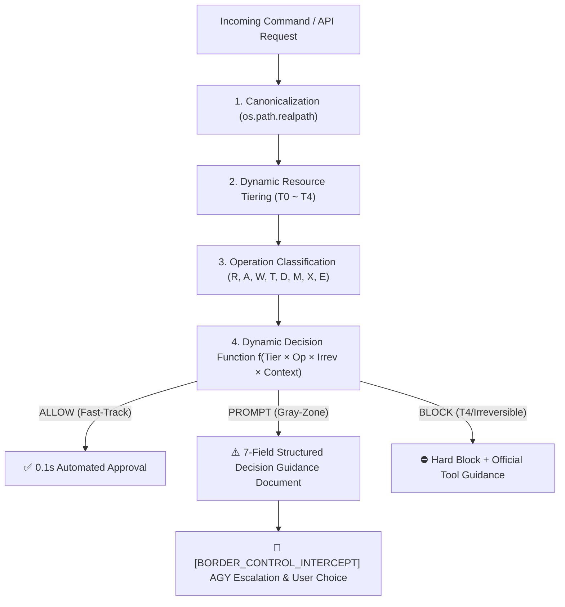

# ADR-004: Non-VCS Irreversible Mutation Governance & Filesystem Gray-Zone Dynamic Evaluation

- **Status**: Active
- **Date**: 2026-08-18
- **Context**: Herdr SmartGate / Schengen Security Architecture
- **Authors**: `bot-agy-macmini <bot-agy-macmini@noreply.localhost>`
- **Reviewer**: Hermes Independent Peer Reviewer (`wW:p1`)

---

## 🧭 1. Context & Problem Statement

Autonomous coding agents typically exhibit **Optimistic Action Bias**, assuming that file mutations and API calls are either benign or easily reversible. While this assumption holds true within clean Git-tracked repositories, it fails catastrophically when applied to **unversioned, stateful, or OS-managed resources (Gray Zones)**:
1. **The Fallacy of Static Labels**: Categorizing an entire folder (e.g. `/var/folders/` or `~/.local/state/`) as universally "safe" or "dangerous" leads to severe security lapses (e.g. deleting active IPC sockets in `/var/folders/.../T/`) or severe friction (e.g. blocking harmless log appending in `~/.local/state/`).
2. **The "Version-Controlled = Safe" Fallacy**: Modifying files inside a Git repository is only reversible if the working tree is `committed & clean`. Uncommitted work is as volatile and irreversible as unversioned files.
3. **The "Regenerable = Free" Fallacy**: Caches and build artifacts (DerivedData, package caches) can theoretically be regenerated, but real reconstruction costs (gigabytes of network egress, hours of compilation) represent significant blast radius.

---

## 🎯 2. Architectural Decisions

### Decision 1: Dynamic Decision Function over Static Labels
Decisions are evaluated at runtime via:
$$\text{Decision} = f(\text{Resource Tier} \times \text{Operation Type} \times \text{Irreversibility Spectrum} \times \text{Execution Context})$$

- **T0 (Ephemeral)**: `/tmp/**`, `/var/tmp/**`, `/var/folders/**/T/` (excluding active Unix domain sockets).
- **T1 (Regenerable with Cost)**: `/var/folders/**/C/` (Caches), `DerivedData`, package caches (`npm`, `pip`, `brew`).
- **T2 (Version-Controlled)**: `~/.local/share/chezmoi/**`, Git repositories (**committed & clean working tree only**).
- **T3 (Durable / Reconstruct-Only)**: `~/.local/state/**`, uncommitted git trees, SQLite DBs, non-chezmoi `~/.config/`.
- **T4 (Irreversible & Integrity-Critical)**: Keychains, TCC permissions, SSH keys, active Unix sockets in `/T/`, destructive Forgejo/DSM APIs.

### Decision 2: Operation $\times$ Tier Matrix

| Tier | Read (R) | Append (A) | Overwrite (W) | Truncate (T) | Delete (D) | Move/Rename (M) | Mutating API (X) | Heavy Exec (E) |
| :--- | :---: | :---: | :---: | :---: | :---: | :---: | :---: | :---: |
| **T0 (Ephemeral)** | ✅ Allow | ✅ Allow | ✅ Allow | ✅ Allow | ✅ Allow | ✅ Allow | ✅ Allow | ✅ Allow |
| **T1 (Caches)** | ✅ Allow | ✅ Allow | ⚠️ **Prompt** | ✅ Allow | ✅ Allow | ✅ Allow | ⚠️ Prompt | ✅ Allow |
| **T2 (Clean Git)** | ✅ Allow | ✅ Allow | ✅ Allow | ✅ Allow | ⚠️ **Prompt** | ✅ Allow | ⚠️ Prompt | ✅ Allow |
| **T3 (State/Logs)** | ✅ Allow | ✅ Allow | ⚠️ **Prompt** | ⛔ **Block** | ⚠️ **Prompt** | ⚠️ **Prompt** | ⚠️ **Prompt** | ⚠️ **Prompt** |
| **T4 (Secrets/OS)**| ⚠️ Prompt | ⚠️ Prompt | ⛔ **Block** | ⛔ **Block** | ⛔ **Block** | ⛔ **Block** | ⚠️ **Prompt** | ⛔ **Block** |

- **T3 Truncate Guard**: `> log` is strictly blocked; rotation (`mv log log.old`) or shadow archiving is required.
- **T4 Hard Block**: Raw file mutations on T4 are denied immediately without shifting burden to the user.

### Decision 3: Standard 7-Field Decision Guidance Document
When an action requires user judgment (`Prompt`), the interceptor formats a 7-field structured escalation document:
1. Target (Canonical realpath or endpoint)
2. Operation (Exact verb)
3. Irreversibility Grade (R0 to R4)
4. Blast Radius (Impact scope)
5. Pre-Alternative (Safe shadow/rotation alternative)
6. Recovery Path (Restoration verification procedure)
7. Structured Choices (A: Backup & Proceed, B: Risk Acceptance, C: Alternative, D: Skip)

### Decision 4: Anti-Fatigue Defense
1. **Batch Aggregation**: Group multi-file changes into a single evaluation payload.
2. **Scope + TTL Caching**: Cache user decisions for `(repo, operation, 1h TTL)`.
3. **Unassisted T4 Block**: Instant rejection for T4 operations to prevent prompt fatigue.

---

## 📊 3. Consequences

- **Positives**:
  - Eliminates state corruption on SQLite databases and unversioned audit trails.
  - Defends macOS system integrity (/var/folders sockets, TCC, LaunchServices) against blind purges.
  - Provides users with structured, actionable choices rather than vague approval questions.
- **Trade-Offs**:
  - Requires dynamic filesystem inspection (`realpath`, `git status`, `stat.S_ISSOCK`), adding ~1-2ms to evaluation overhead.
