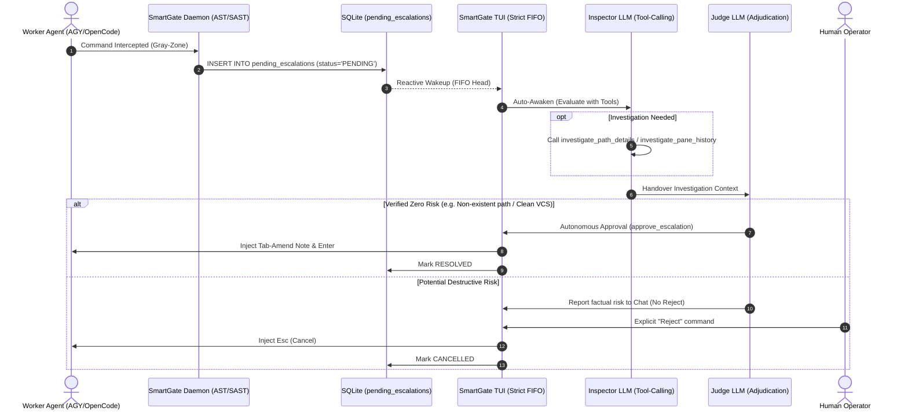

# ADR-009: SmartGate TUI, Dual-Model Phase Routing, and Strict Sequential FIFO Escalation Governance

- **Status**: Evolved (extended by ADR-011 model defaults + ADR-015 tiered reject)
- **Date**: 2026-08-26
- **Authors**: Security Team & Autonomous Coding Agents (AGY / OpenCode / Hermes)
- **Supersedes / Extends**: [ADR-002](./adr-002-dynamic-substitution-tool-calling-inspector.md), [ADR-005](./adr-005-autonomous-orchestration-and-deadlock-defense.md), [ADR-008](./adr-008-opencode-alternative-host-runtime.md)

---

## 1. Context & Problem Statement

As multi-agent concurrency increased across Herdr workspaces (Antigravity/AGY, OpenCode, Codex, Pi), four operational challenges emerged:

1. **Visual Fatigue & TUI Readability**: Early TUI implementations used high-saturation solid background colors (e.g. solid orange banner fills, bright cyan panel borders), causing visual fatigue and obscuring active escalation targets.
2. **LLM Cost & Role Specialization**: A single monolithic model invocation for both deep filesystem tool-calling (Inspector) and high-level policy judgement (Judge) caused token inefficiency. Teams needed the ability to route the tool-calling Inspector phase to faster/cost-effective models while routing the final Judge phase to stronger reasoning models.
3. **Escalation Queue Concurrency Clashes**: When multiple agents executed gray-zone commands simultaneously, simultaneous chat delivery caused confusing interleaving of evaluation threads in the TUI.
4. **Agent Adjudication Feedback Protocol**: AGY agents support rich `tab` message amendment during approval, allowing security gatekeepers to inject verifiable context (`# [SECURITY GATEKEEPER]: ...`) without human manual intervention.

---

## 2. Decision Outcomes

### D1: Muted Design System & Spatial Ergonomics
- **No Solid Fills on Large Surfaces**: Banners use left-accent border highlights (`border-left: heavy $warning;`) on dark surface backgrounds.
- **Visual Hierarchy**: Data values are rendered in crisp white (`[white]`), while metric labels use dimmed tones (`[dim]`).
- **Constrained Command Palette**: Command Palette (`Ctrl+P`) is capped to a centered 72-character column with constrained vertical scroll (`max-height: 60%`), preventing full-width layout distortion.
- **Mac Clipboard Integration**: `Ctrl+Y` copies plain-text chat history directly to the macOS clipboard via `pbcopy`.

### D2: Dual-Model Phase Routing Architecture
- **Inspector Phase (Tool Calling)**: Configured via `SCHENGEN_INSPECTOR_API_KEY`, `SCHENGEN_INSPECTOR_BASE_URL`, and `SCHENGEN_INSPECTOR_MODEL` (default: `gpt-5.6-luna`). Discretionary tool invocation for `investigate_path_details`, `investigate_pane_history`, and `read_file_snippet`.
- **Judge Phase (Final Adjudication)**: Configured via `SCHENGEN_JUDGE_API_KEY`, `SCHENGEN_JUDGE_BASE_URL`, and `SCHENGEN_JUDGE_MODEL`. Executes once tool calls settle.
- **Worker Independence**: Supervised workers (e.g., OpenCode, AGY) are purely the subjects of governance; the Judge is an independent LLM phase and does not rely on worker runtimes.

### D3: Strict Sequential Single-Active FIFO Pipeline
- SQLite table `pending_escalations` serves as the authoritative queue.
- `get_current_active_escalation()` strictly isolates the single oldest `PENDING` record (FIFO head).
- Chat delivery, auto-awaken triggers, and interactive banner focus operate exclusively on the current active item until resolved or cancelled.

### D4: AGY Tab-Amend Interception & Zero Autonomous Reject Invariant
- **AGY Approval**: Uses `tab` → inject `# [SECURITY GATEKEEPER]: <English note>` → `enter` to supply machine-verifiable approval context.
- **Zero Autonomous Reject**: Autonomous gatekeepers are strictly forbidden from calling `reject_escalation`. Destructive threats must be reported factually to the human operator for explicit confirmation (`거절`, `차단`, `reject`).

---

## 3. Architecture Flow Diagram

---

## 4. Consequences & Verification

- **Positive**:
  - Eliminated visual strain and reduced operator cognitive load.
  - Enabled multi-model cost optimization (e.g., small tool-caller + high-reasoning judge).
  - Guaranteed deadlock-free serial queue progression for multi-agent workloads.
- **Verification**:
  - 100% unit and E2E coverage across `tests/test_schengen_tui_and_agent.py` and `tests/test_e2e_escalation_lifecycle.py`.
  - Pyright static type analysis: 0 errors.
